# 🚀 Agentic AP Platform

An enterprise-style AI-powered Accounts Payable (AP) platform built using **React, TypeScript, Node.js, Express.js**, and **Mock JSON APIs**. The application automates invoice processing, vendor management, notifications, dashboards, and application settings through a modern, responsive, and user-friendly interface.

---

# 📌 Project Overview

The Agentic AP Platform is a Proof of Concept (POC) that demonstrates an intelligent invoice processing workflow. Users can upload invoices, monitor processing status, manage vendors, receive real-time notifications, and analyze business insights using interactive dashboards.

The application is designed with reusable components, responsive layouts, clean architecture, and scalable code organization.

---

# ✨ Features

## 📄 Module 1 – Invoice Upload

- Upload invoice documents
- Invoice validation
- Upload success/error notifications
- Invoice storage using mock backend
- Responsive upload page

---

## 📑 Module 2 – Invoice Processing

- Invoice processing workflow
- Processing status updates
- Invoice details modal
- Status badges
- Search invoices
- Sorting
- Filtering

---

## 🔔 Module 3 – Notifications

- Real-time notification drawer
- Unread notification badge
- Mark notifications as read
- Auto-refresh notifications using polling

---

## 📊 Module 4 – Invoice Dashboard

Dashboard Cards

- Total Invoices
- Processing
- Human Review
- Approved
- Failed

Charts

- Status Distribution
- Daily Invoice Processing
- Vendor-wise Invoice Count

Additional Features

- Average Processing Time
- Refresh Dashboard
- Empty State Handling

---

## 🏢 Module 5 – Vendor Management

- Add Vendor
- Edit Vendor
- Delete Vendor
- View Vendor Details
- Search Vendors
- Sorting
- Pagination
- CSV Export
- Toast Notifications
- Zod Form Validation

---

## 📈 Module 6 – Vendor Dashboard

Dashboard Cards

- Total Vendors
- Active Vendors
- Inactive Vendors
- Vendors Awaiting Approval

Charts

- Vendor Country Distribution
- Monthly Vendor Creation
- Top Vendors by Invoice Count

Additional Features

- Refresh Dashboard
- Empty State Handling

---

## ⚙️ Settings Module

- User Profile
- Notification Preferences
- Theme Settings
- System Settings
- Auto Refresh Settings

---

# ⭐ Additional Features

- 🌙 Light & Dark Theme
- 🔍 Global Search (Invoices & Vendors)
- 📤 Export Vendors to CSV
- 📤 Export Invoices to CSV
- ✅ Form Validation using Zod
- ♿ Accessibility Improvements (ARIA Labels)
- 📱 Fully Responsive Design
- 🔥 React Hot Toast Notifications
- 📊 Interactive Charts
- 🎨 Modern UI using Tailwind CSS
- 🧩 Reusable Components

---

# 🛠 Tech Stack

## Frontend

- React
- TypeScript
- Vite
- Tailwind CSS
- React Router
- Recharts
- React Hot Toast
- Lucide React
- Zod

## Backend

- Node.js
- Express.js
- Mock JSON APIs

---

# 📂 Folder Structure

```
InnowaveProject
│
├── backend
│   ├── controllers
│   ├── routes
│   ├── services
│   ├── data
│   └── ...
│
├── frontend
│   ├── components
│   ├── context
│   ├── pages
│   ├── validations
│   └── ...
│
├── Screenshots
│
└── README.md
```

---

# ⚙️ Installation & Setup

## Clone Repository

```bash
git clone https://github.com/NishaM02/innowave360-agentic-ap-platform.git
```

---

## Backend

```bash
cd backend
npm install
npm run dev
```

Backend runs on:

```
http://localhost:5000
```

---

## Frontend

```bash
cd frontend
npm install
npm run dev
```

Frontend runs on:

```
http://localhost:5173
```

---

# 🏗 Architecture Overview

```
                React + TypeScript
                        │
                        │ REST APIs
                        ▼
             Express.js Backend
                        │
                        ▼
               Mock JSON Database
```

The frontend communicates with Express.js REST APIs for invoice processing, vendor management, notifications, dashboards, and settings. Mock JSON files are used as the backend data source for this proof of concept.

---

# 📸 Screenshots

## Dashboard

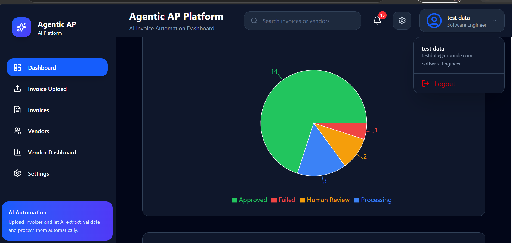

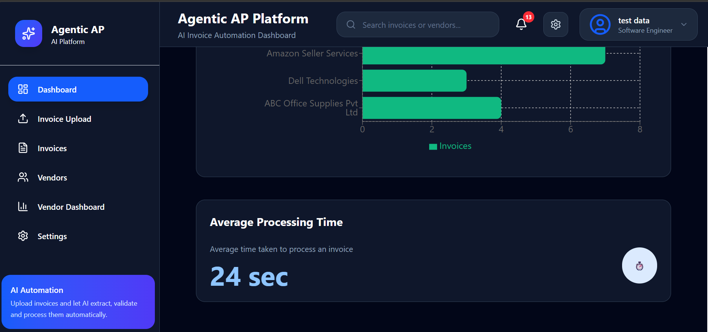

---

## Invoice Upload

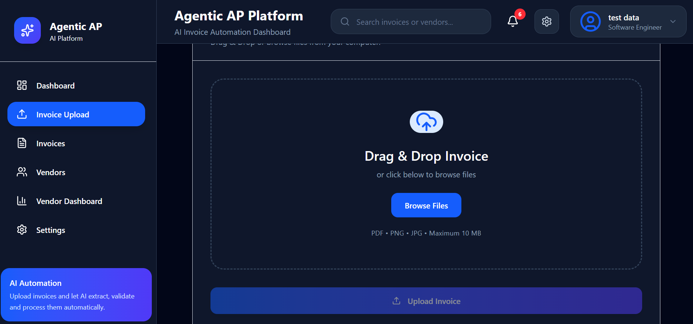


---

## Invoice Management

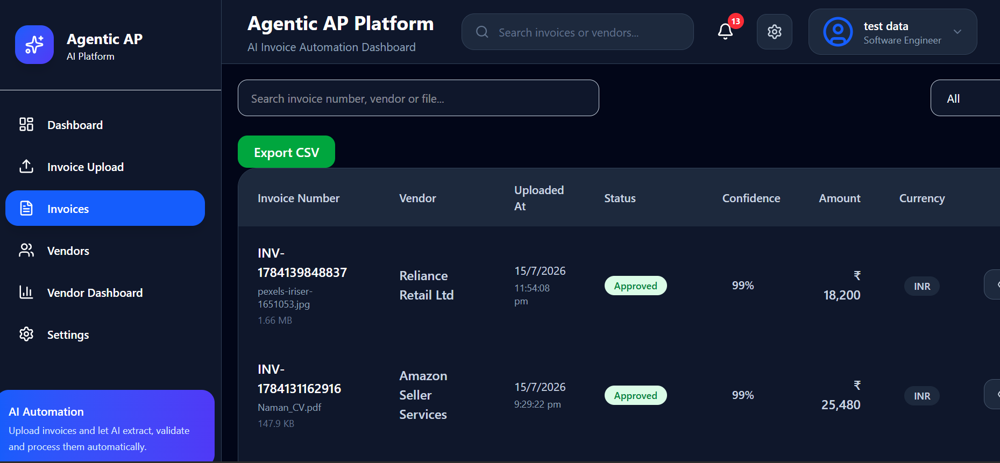

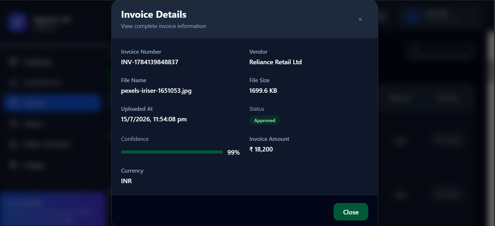

---

## Vendor Management

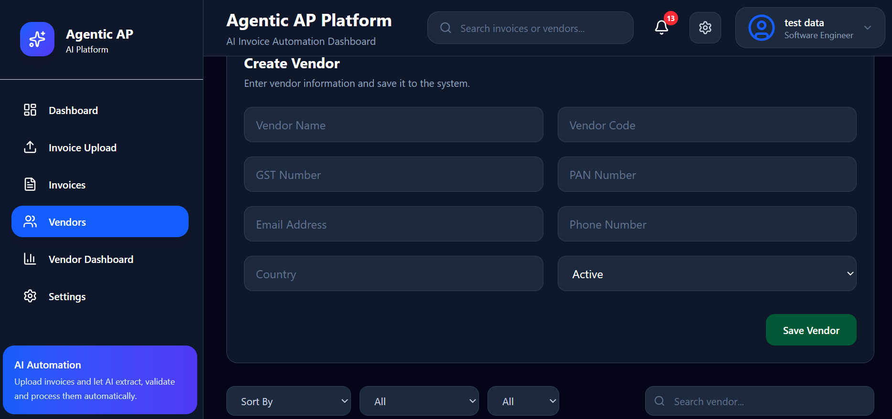

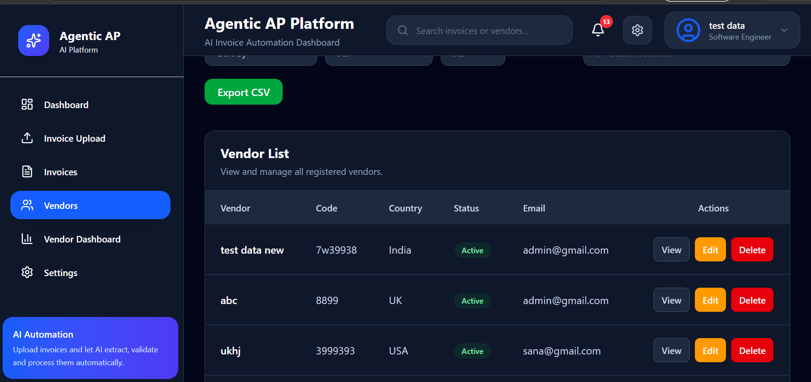

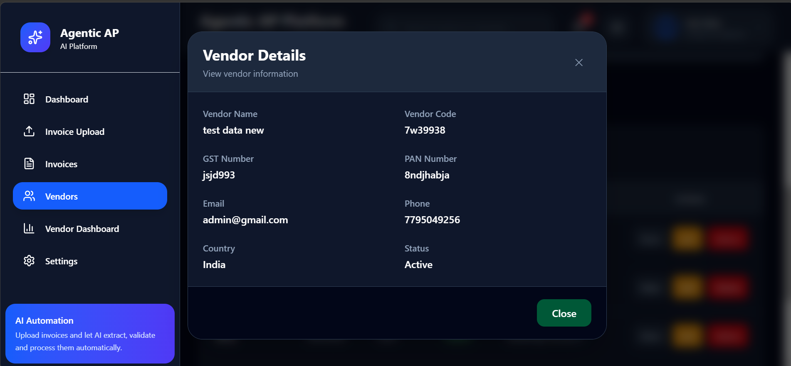

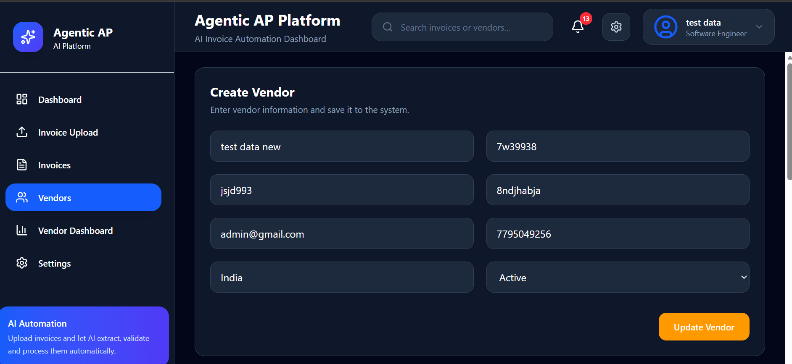

---

## Vendor Dashboard

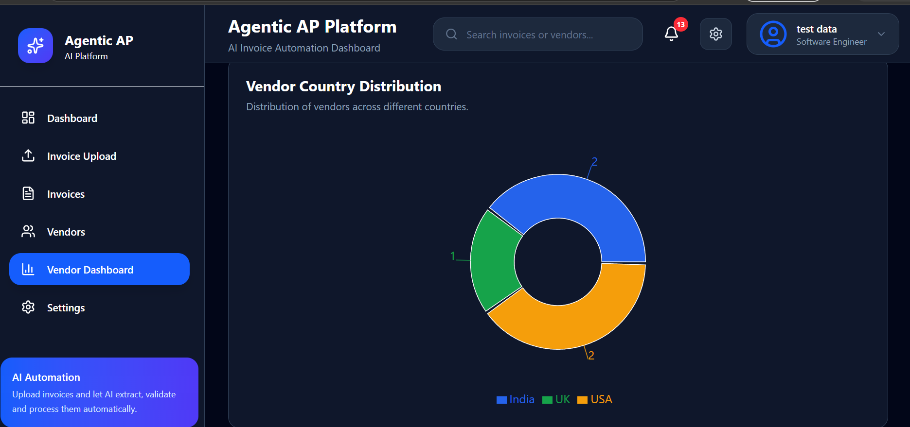

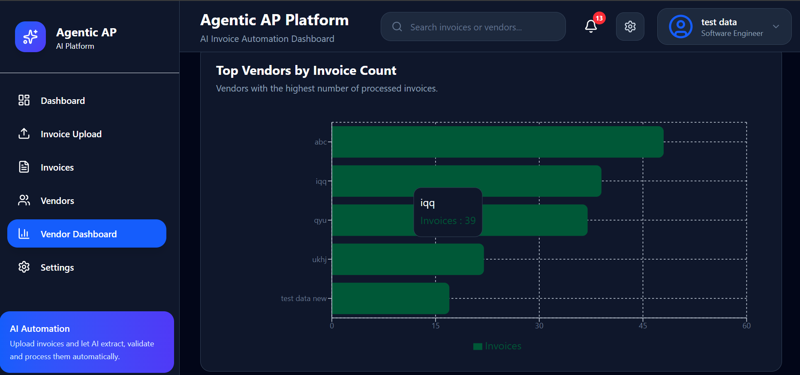


---

## Notifications

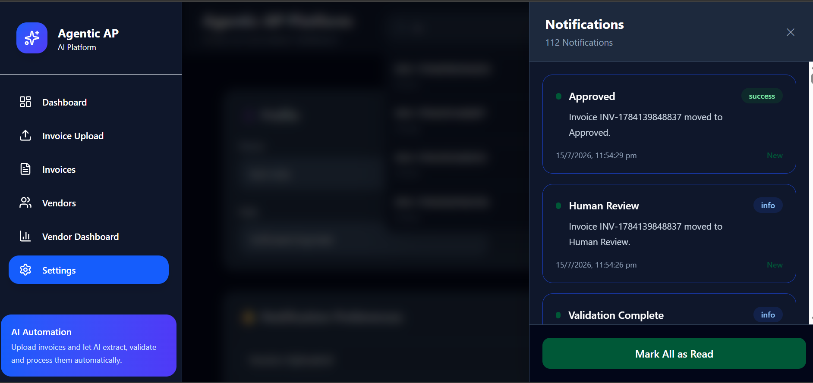

---

## Settings

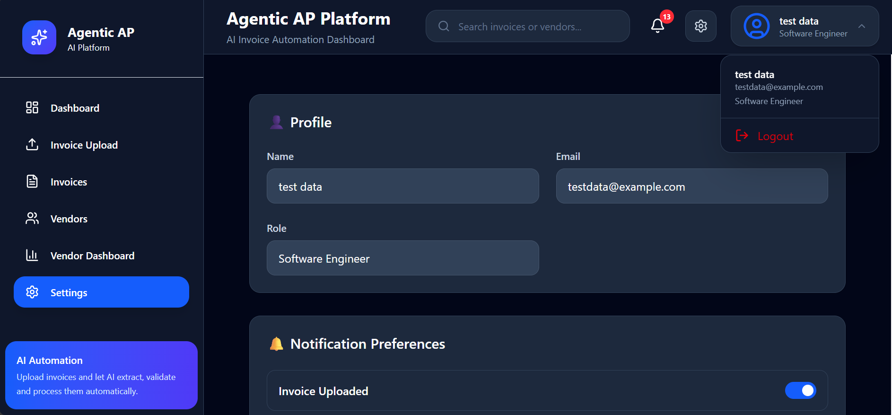

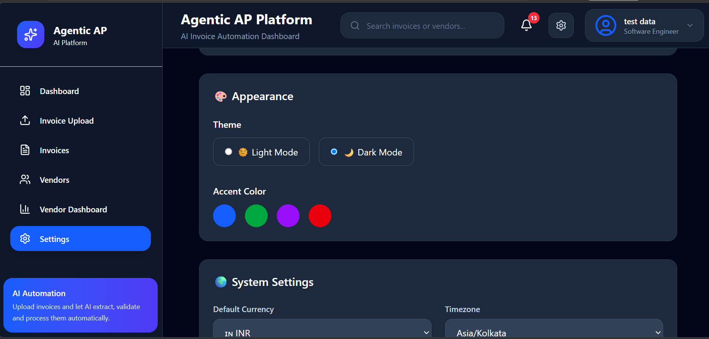

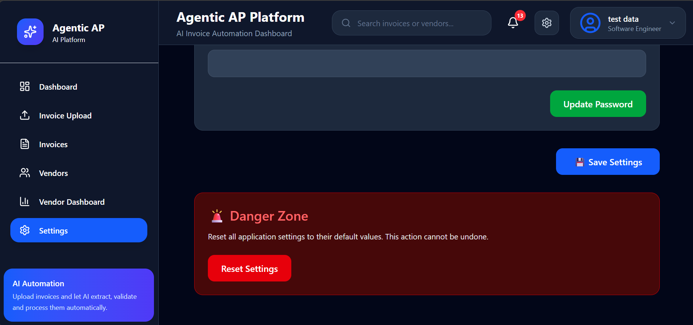

---

## Global Search

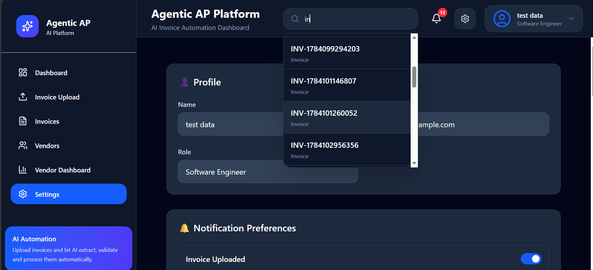

---

## Light Theme

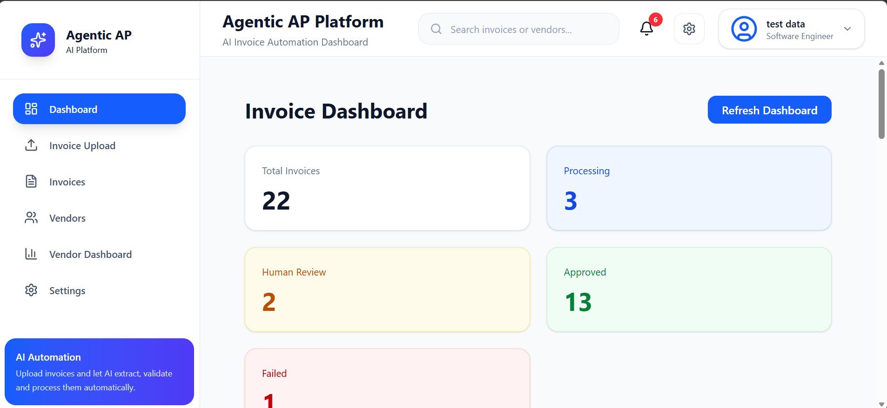

---

## Responsive Design

### Mobile View

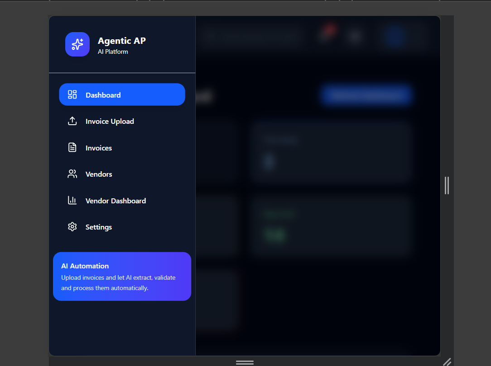

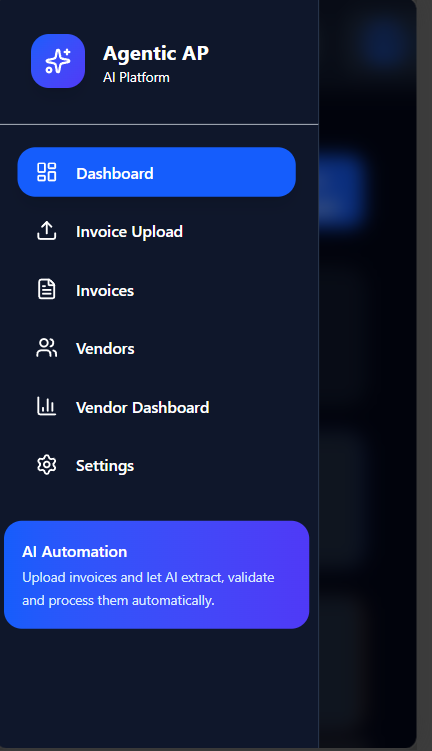

---

# ♿ Accessibility

The application includes accessibility improvements such as:

- ARIA Labels
- Keyboard-friendly controls
- Accessible buttons
- Proper form labels
- Responsive layouts

---

# 📱 Responsive Design

The application is fully responsive and optimized for:

- Desktop
- Tablet
- Mobile Devices

---

# ⚠️ Assumptions

- Invoice processing is simulated using mock APIs.
- Dashboard analytics are generated from mock JSON data.
- Authentication is outside the scope of this Proof of Concept.
- Notifications are implemented using polling.

---

# 🚧 Challenges

- Designing reusable React components
- Managing application state efficiently
- Building responsive dashboards
- Implementing vendor analytics
- Creating a scalable folder structure
- Maintaining a consistent UI across modules

---

# 🚀 Future Improvements

- Role-Based Authentication
- Docker Compose Support
- WebSocket-based Real-Time Notifications
- Unit Testing
- End-to-End Testing
- Infinite Scrolling
- Advanced Search Filters
- PostgreSQL Database Integration
- OCR Integration with AI Models

---

# 👩‍💻 Developer

**Nisha M**

GitHub: https://github.com/NishaM02

---

# 📄 License

This project was developed as part of a technical assessment / Proof of Concept (POC).